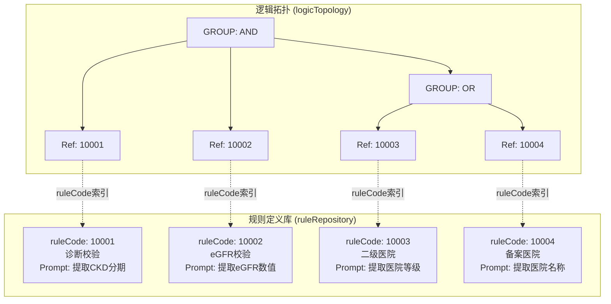
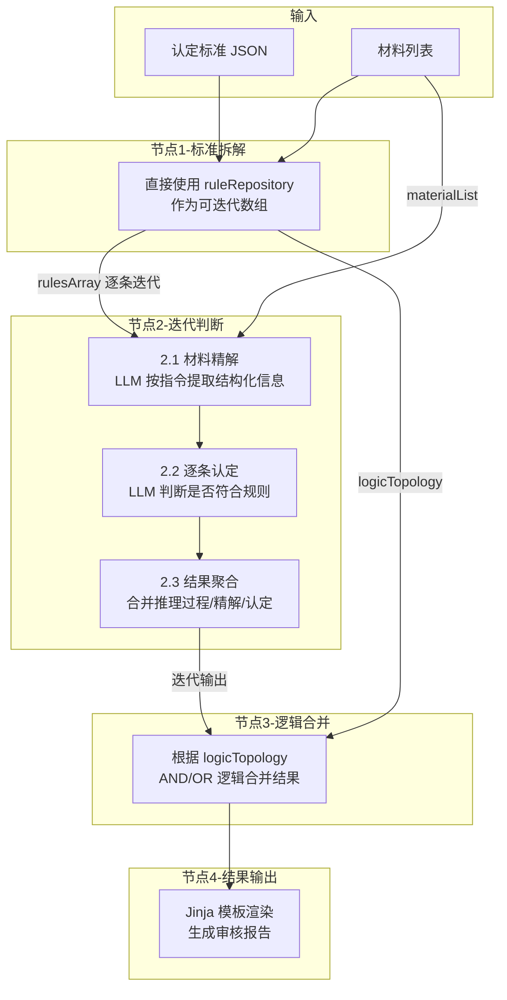

# 医保门慢特病认定标准配置架构说明

## 1. 核心设计理念

本系统采用**"元数据 + 内容定义 + 逻辑编排"三层分离**的架构设计模式。

- **Part 1: 元数据 (meta)**：
  - 相当于"封面"或"索引卡"。
  - 存储病种的基础信息（版本号、病种名称、病种编码、创建时间、更新说明）。
  - **特点**：轻量级，便于版本管理和快速检索。
- **Part 2: 规则定义库 (ruleRepository)**：
  - 相当于"字典"或"仓库"。
  - 存储每一条认定标准的具体元数据（如：政策依据、LLM提取指南、判定阈值）。
  - **特点**：数组结构存储，以 `ruleCode` 为索引，不包含任何逻辑关系。
- **Part 3: 逻辑拓扑树 (logicTopology)**：
  - 相当于"蓝图"或"电路图"。
  - 仅存储规则的引用编码 (`RULE_REF`) 和逻辑组合关系 (`GROUP` - AND/OR)。
  - **特点**：轻量级树状结构，描述审核的执行流程。

---

## 2. 架构图解



---

## 3. 数据结构详解

### Part 1: 元数据 (`meta`)

存储病种认定标准的基础信息，便于版本管理和系统集成。

**示例结构：**

```json
"meta": {
  "criteriaVersion": "V2026011001",           // 标准版本号
  "chronicDiseaseName": "尿毒症肾透析治疗",    // 病种名称
  "chronicDiseaseCode": "M4105",              // 病种编码
  "createdAt": "2026-01-11",                  // 版本创建时间
  "description": "初始版本"                    // 更新说明
}
```

**关键字段说明：**

| 字段 | 说明 |
| ---- | ---- |
| `criteriaVersion` | 标准版本号，建议格式：V + 年月日 + 序号 |
| `chronicDiseaseName` | 病种名称，用于前端展示 |
| `chronicDiseaseCode` | 病种编码，用于系统对接 |
| `createdAt` | 版本创建时间 |
| `description` | 本次更新的变更说明 |

---

### Part 2: 规则定义库 (`ruleRepository`)

这是一个**数组结构**，每个元素为规则详情对象，以 `ruleCode` 作为唯一标识。

**示例结构：**

```json
"ruleRepository": [
  {
    "ruleCode": "10002",
    // 政策原文
    "ruleContent": "需长期透析治疗 (参考指标 eGFR)",
    // 政策依据
    "ruleSource": "统一病种泰医保发〔2023〕14号转发关于规范统一全省门诊慢特病基本病种提高慢特病医疗保障能力的通知",

    // 经验标准（可选，用于数值判定）
    "experience": "eGFR≤15ml/min/1.73m²",

    // 提取项说明（数组结构）
    "ruleKeywordGuide": [
      {
        "keywordCode": "10002001",
        "keywordContent": "提取最近一次eGFR检测数值，忽略参考范围",
        "dataType": "string",
        "required": true
      },
      {
        "keywordCode": "10002002",
        "keywordContent": "提取eGFR的单位，通常为ml/min/1.73m²",
        "dataType": "string",
        "required": false
      }
    ]
  }
]
```

**关键字段说明：**

| 字段 | 说明 |
| ---- | ---- |
| `ruleCode` | 规则唯一编码 |
| `ruleContent` | 政策原文，直接摘录自医保政策文件 |
| `ruleSource` | 政策依据，说明规则来源的政策文件 |
| `experience` | 经验标准，在政策原文基础上进行深度解读后的细化判定规则（可选） |
| `ruleKeywordGuide` | 提取项说明（数组），指导 LLM 从非结构化文本中提取结构化数据 |

**ruleKeywordGuide 子字段说明：**

| 字段 | 说明 |
| ---- | ---- |
| `keywordCode` | 关键词唯一编码 |
| `keywordContent` | 提取指引，说明如何提取该字段 |
| `dataType` | 数据类型：`string` / `enum` |
| `enumOptions` | 枚举选项（当 `dataType` 为 `enum` 时必填） |
| `required` | 是否必填 |

**注意**：系统会对用户上传的所有材料进行逐条判断，不再限制数据来源类型。

---

### Part 3: 逻辑拓扑树 (`logicTopology`)

这是一个递归的 Tree 结构，节点类型分为 **容器 (`GROUP`)** 和 **引用 (`RULE_REF`)**。

**示例结构：**

```json
"logicTopology": {
  "type": "GROUP",      // 类型：容器
  "operator": "AND",    // 逻辑：且 (所有子节点必须通过)
  "children": [
    {
      "type": "RULE_REF",  // 类型：引用
      "ruleCode": "10002"  // 指针：指向 ruleRepository 中 ruleCode 为 10002 的规则
    },
    {
      "type": "GROUP",     // 嵌套容器
      "operator": "OR",    // 逻辑：或 (子节点满足其一即可)
      "children": [
        { "type": "RULE_REF", "ruleCode": "10003" },
        { "type": "RULE_REF", "ruleCode": "10004" }
      ]
    }
  ]
}
```

**节点类型说明：**

- **`GROUP`**: 逻辑组。
  - 必填字段: `operator` ("AND" | "OR"), `children` (Array)。

- **`RULE_REF`**: 规则引用。
  - 必填字段: `ruleCode` (对应 ruleRepository 数组中规则的 `ruleCode`)。

---

## 4. 开发集成指南

### 前端渲染逻辑 (Vue/React)

1. **获取数据**：同时请求 `ruleRepository` 和 `logicTopology`。
2. **递归渲染**：从 logicTopology 根节点开始遍历。
   - 遇到 `GROUP`：渲染为一个带边框的容器组件（蓝色/绿色）。
   - 遇到 `RULE_REF`：读取 `ruleCode`，去 ruleRepository 数组中查找对应的 `ruleContent` 等详情，渲染为表格行组件。
3. **编辑操作**：
   - 修改规则内容（如阈值）：只更新 ruleRepository。
   - 拖拽/排序规则：只更新 logicTopology。

### 后端执行逻辑 (Dify 工作流)

基于 Dify 搭建的审核工作流，包含以下节点：

#### 工作流入参

- 认定标准 JSON（完整的 `meta` + `ruleRepository` + `logicTopology`）
- 材料列表（患者上传的所有病历材料）

---

#### 节点 1：标准拆解

**功能**：将认定标准中的 `ruleRepository` 直接作为可迭代的规则数组使用。

**输入**：

- `certificationList`：认定标准 JSON
- `materialList`：材料列表

**输出结构**：

```json
{
  "chronicDiseaseCode": "M4105",
  "chronicDiseaseName": "尿毒症肾透析治疗",
  "logicTopology": { ... },
  "rulesArray": [
    {
      "ruleCode": "10001",
      "ruleContent": "各种原因造成慢性肾脏损伤，并出现肾功能异常达到尿毒症期",
      "experience": null,
      "ruleKeywordGuide": [ ... ]
    },
    ...
  ],
  "rulesCount": 4
}
```

---

#### 节点 2：逐条判断（迭代节点）

迭代遍历每条认定标准，包含以下三个子步骤：

##### 2.1 材料精解（LLM 节点）

**功能**：从材料列表中，按照 `ruleKeywordGuide` 提取结构化信息。

**核心规则**：

- 按指令逐条提取：每条 `ruleKeywordGuide` 中的字段独立提取
- 材料遍历：遍历整个 `materialList` 中的所有材料，优先从最新材料提取
- rawText 必须包含上下文：完整句或短段，不能只输出单个词
- value 必须有证据：必须能在 `rawText` 中找到直接证据

**输出结构**：

```json
{
  "10001001": {
    "found": true,
    "results": [
      {
        "rawText": "出院诊断：慢性肾衰竭，尿毒症期，贫血。",
        "value": "慢性肾衰竭",
        "materialId": "MAT-20250115-001",
        "materialName": "患者病历报告",
        "materialSource": "医院信息系统"
      }
    ]
  },
  "10002001": {
    "found": false,
    "results": []
  }
}
```

##### 2.2 逐条认定（LLM 节点）

**功能**：根据精解结果判断患者是否满足认定规则。

**分析框架**：

1. 理解规则意图：规则的分界线是什么？评估哪个维度（病情严重度/治疗必要性/诊断确定性）？
2. 对照患者状态：患者处于分界线哪一侧？证据是否充分？

**关键约束**：

- `found=false` 或无 `results` → 视为"未找到证据"，不得推断
- 不符合时：找出所有不符合点，每个点独立记录
- 证据必须引用精解结果中的 `rawText`

**输出结构**：

符合时：

```json
{
  "ruleCode": "10003",
  "result": "符合",
  "ruleContent": "有二级及以上医疗机构出具的病历资料"
}
```

不符合时：

```json
{
  "ruleCode": "10001",
  "result": "不符合",
  "ruleContent": "各种原因造成慢性肾脏损伤，并出现肾功能异常达到尿毒症期",
  "suspicion": [
    {
      "type": "指标异常",
      "detail": "精解结果显示患者慢性肾脏病分期为CKD4期，但认定规则要求需达到尿毒症期（通常对应CKD5期）。",
      "sources": [
        {
          "materialName": "入院诊断",
          "materialId": "MAT-20250110-001",
          "excerpt": "【诊断】1.慢性肾脏病4期 2.慢性肾小球肾炎"
        },
        {
          "materialName": "病史摘要",
          "materialId": "MAT-20250110-003",
          "excerpt": "【病史】半年前升至365μmol/L(CKD4期)。"
        }
      ]
    }
  ]
}
```

**异常类型选项**：

- `指标异常`：数值/指标不满足标准
- `信息缺失`：关键信息未找到
- `资质不符`：医院等级/资质不满足
- `临床表现不足`：症状/体征不符合要求
- `材料不全`：材料类型不完整

##### 2.3 结果聚合（代码节点）

**功能**：将推理过程、精解结果、认定结果聚合为单条输出。

**输出结构**：

```json
{
  "output": [{
    "ruleResult": [...],
    "reasoningContent": "LLM推理过程原文...",
    "extractionList": [...]
  }]
}
```

---

#### 节点 3：逻辑合并（代码节点）

**功能**：根据 `logicTopology` 的 AND/OR 逻辑，合并各条标准的判断结果。

**逻辑计算**：

- `GROUP` + `AND`：所有子节点必须为"符合"
- `GROUP` + `OR`：子节点任一为"符合"即可
- `RULE_REF`：查找对应 ruleCode 的判断结果

**输出结构**：

```json
{
  "finalResult": "不合规",
  "ruleResults": [
    {
      "ruleCode": "10001",
      "result": "不符合",
      "ruleContent": "各种原因造成慢性肾脏损伤...",
      "reasoningContent": "好的，我是一名经验丰富的医保审核专家...",
      "suspicion": [...]
    },
    {
      "ruleCode": "10002",
      "result": "不符合",
      "ruleContent": "需长期透析治疗",
      "reasoningContent": "...",
      "suspicion": [...]
    },
    {
      "ruleCode": "10003",
      "result": "符合",
      "ruleContent": "有二级及以上医疗机构出具的病历资料",
      "reasoningContent": "..."
    }
  ]
}
```

---

#### 节点 4：审核结果输出（Jinja 模板）

**功能**：将结构化审核结果渲染为可读的 Markdown 格式。

**模板示例**：

```jinja
## 审核结果：{{ finalResult }}


---
### 规则 {{ item.ruleCode }}：{{ item.result }}


**规则说明**：{{ item.ruleContent }}



**推理过程**：
{{ item.reasoningContent }}




#### 不符合点 {{ loop.index }}：{{ suspicionItem.type }}

**详情**：{{ suspicionItem.detail }}

**证据来源**：

- **{{ src.materialName }}**（{{ src.materialId }}）
  > {{ src.excerpt }}





```

---

## 5. 工作流架构图



---

## 6. 优势总结

1. **流量极简**：列表页只需加载拓扑树，无需加载沉重的规则文本。
2. **复用性强**：同一条规则（如"三级医院校验"）可被多个逻辑组引用，修改一次处处生效。
3. **职责清晰**：运营人员专注于维护"仓库"里的规则准确性；风控专家专注于调整"蓝图"里的逻辑严密性。
4. **推理可追溯**：每条规则的判断都保留完整推理过程 (`reasoningContent`)，便于审计和问题排查。
5. **精解与认定分离**：先提取结构化信息，再基于精解结果判断，避免 LLM 产生幻觉或依赖不存在的信息。
6. **命名规范**：统一采用 camelCase 驼峰命名，与前端 JavaScript/TypeScript 代码风格保持一致。
