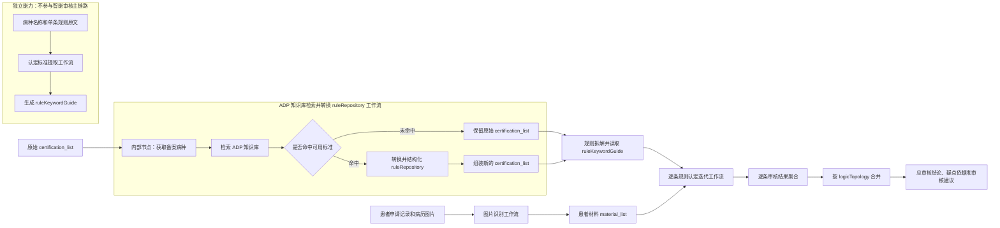

# 场景名称：门诊慢特病智能审核助手

我们基于 ADP 平台搭建并发布“门诊慢特病智能审核助手”

**目标**：我们基于 ADP 平台建设“门诊慢特病智能审核助手”，将认定标准获取与解析、医疗材料图像识别、患者材料精解、逐条规则认定、审核结果汇总等能力统一编排为完整的智能审核流程，为医保审核人员提供可追溯、可复核的审核结论和疑点依据。

**场景描述：**当患者提交门诊慢特病申请后，智能体根据申请病种获取对应的认定标准和患者申请材料。对于图片形式的病历、检查报告和诊断证明，智能体先完成图像文字识别；随后按照认定标准逐条提取患者材料中的有效证据并进行规则判断，最终依据标准中配置的 AND/OR 逻辑合并审核结果，生成总审核结论、疑点依据和审核建议，供医保审核人员复核。

**示例问题：**请审核这位患者的门诊慢特病申请，判断是否符合认定标准，并列出不符合项、疑点依据和审核建议。

**建设内容：**

**1）建设统一的智能审核助手**：我们通过 ADP 平台可视化界面搭建并发布“门诊慢特病智能审核助手”，将图片识别、ADP 知识库检索与规则转换、逐条规则认定和结果汇总等工作流统一编排。业务人员通过一个智能体入口即可发起审核，无需分别操作底层工作流。平台同时提供独立的“认定标准提取”工作流，用于辅助标准配置，但不参与智能审核主流程的运行串联。

**2）接入认定标准及患者材料数据**：智能体可对接省、市医保数据专区或平台已配置的数据服务，获取患者申请记录、病历材料和对应病种的认定标准。认定标准采用 `meta + ruleRepository + logicTopology` 结构：`meta` 用于记录病种及版本信息，`ruleRepository` 用于保存逐条审核规则及证据提取要求，`logicTopology` 用于描述规则之间的 AND/OR 组合关系。

**3）实现认定标准获取与拆解**：智能体首先从认定标准中识别备案病种，并优先从 ADP 知识库获取与当前病种匹配的标准内容。知识库命中时，系统将检索结果转换为结构化 `ruleRepository`；未命中或生成结果异常时，系统自动回退至原始认定标准。最终选定的 `ruleRepository` 会被拆解为可迭代的规则数组，同时保留 `logicTopology`，用于后续总审核结果计算。

**4）提供图片识别与患者材料精解能力**：对于图片形式的医疗材料，智能体通过多模态模型按照原图内容完成文字转写，并将识别文本纳入患者材料列表。进入审核后，智能体根据每条规则的 `ruleKeywordGuide` 遍历患者全部材料，提取诊断、检验指标、治疗记录和医疗机构资质等结构化信息。每项提取结果均保留材料名称、材料编号和原文片段；没有直接证据时，系统明确标记为未找到，不进行推测或补造。

**5）实现逐条规则认定**：智能体根据患者材料精解结果逐条判断患者是否满足认定规则，并输出规则编码、规则内容和“通过/不通过”结果。当单条规则不通过时，系统同步生成疑点类型、疑点说明及对应材料原文。疑点类型覆盖指标异常、信息缺失、资质不符、临床表现不足和材料不全等常见审核问题。

**6）实现审核结果聚合与逻辑合并**：智能体将每条规则的精解结果、认定结果、疑点依据和推理过程聚合为统一结构，再根据 `logicTopology` 执行 AND/OR 逻辑计算，生成唯一的总审核结果 `finalResult`。总审核结论由完整逻辑拓扑计算产生，不会因为某一条规则单独通过或不通过而错误反推整体结论。

**7）生成可复核的审核建议**：当 `finalResult` 为“通过”时，智能体生成简洁明确的通过建议；当 `finalResult` 为“不通过”时，重点汇总真正导致整体不通过的规则、材料证据和疑点。若系统未获得有效的总审核结果，则提示审核信息不完整，不自行生成通过或不通过结论。

**8）完成智能体发布与场景验证**：我们完成智能体的工作流编排、节点调试和应用发布，并使用脱敏或虚构的患者申请材料开展场景验证。智能体输出同时展示总审核结论、逐条规则结果、疑点依据和审核建议，并支持追溯到具体材料原文。演示与验收过程中不使用真实患者隐私数据。

## 整体流程及工作流串联关系

“门诊慢特病智能审核助手”对业务人员呈现为一个统一智能体。智能审核主链路由图片识别、ADP 知识库检索与规则转换、逐条规则认定和结果汇总等工作流构成。其中，备案病种获取是 ADP 知识库检索与规则转换工作流的内部节点，不是独立工作流。“认定标准提取”作为独立工作流存在，用于单独生成规则提取项，不在该主链路中被调用。

整体处理过程分为四个阶段：

1. **材料准备**：图片识别工作流将病历图片原样转写为文本，形成后续审核可读取的患者材料。
2. **标准准备**：ADP 知识库检索与规则转换工作流先从原始认定标准中获取备案病种，再检索知识库；命中可用标准时即时生成新的规则库，未命中时继续使用原始标准。
3. **逐条审核**：将最终选定的认定标准拆成规则数组，直接使用其中已有的 `ruleKeywordGuide`，再调用迭代子工作流逐条完成材料精解和规则认定。
4. **结果汇总**：主工作流汇总全部规则结果，按照 `logicTopology` 中的 AND/OR 关系计算总审核结果并生成审核建议。

## 各工作流说明

### 1. 主审核工作流

**作用**：作为全流程调度中心，接收患者材料和认定标准，组织各子工作流执行，并生成最终审核结果。

**主要处理过程**：

- 接收最终选定的 `certification_list` 和患者材料 `material_list`。
- 将 `ruleRepository` 转换成可迭代的 `rulesArray`。
- 逐条调用规则认定迭代工作流。
- 汇总每条规则的认定结果、证据、疑点和推理过程。
- 根据 `logicTopology` 执行 AND/OR 逻辑计算，生成唯一的 `finalResult`。
- 根据总审核结果及真正影响总结果的规则生成审核建议。

主审核工作流承担全流程组织和结果汇总，审核结论均来自标准化子工作流的处理结果，不直接依据原始图片或单条材料进行推断。

### 2. 图片识别工作流

**作用**：将患者上传的病历、检查报告、诊断证明等医疗记录图片转换为后续流程可读取的文本，是患者材料进入智能审核流程的前置入口。

**输入**：

- `image`：待识别的医疗记录图片。
- `userRequirement`：可选的识别范围或额外要求。

**输出**：

- `recognizedText`：按照原图标题、段落、表格、行列及换行顺序转写的文本。

**处理原则**：

- 只识别图像中清晰可见的内容，不作诊断判断或医学推断。
- 不归纳、不总结、不补全缺失文字。
- 模糊内容标记为 `[模糊]`，图片缺失区域标记为 `[图像不完整]`。
- 系统将识别结果与材料编号、材料名称和材料来源一起组装进 `material_list`，供后续证据提取使用。

图片识别工作流主要解决“让系统看清材料”的问题，是否符合认定标准由后续规则认定流程判断。

### 3. ADP 知识库检索并转换规则库工作流

**作用**：根据备案病种名称和编码检索 ADP 知识库，将命中的政策或认定标准正文转换为主审核工作流可执行的结构化认定标准。

**输入**：

- `certification_list`：包含 `meta`、`ruleRepository` 和 `logicTopology` 的原始认定标准。

**输出**：

- `certification_list`：知识库命中时输出新组装的结构化认定标准；未命中或组装异常时输出原始认定标准。

`chronicDiseaseName` 和 `chronicDiseaseCode` 是该工作流内部“获取备案病种”节点的中间输出，用于驱动后续知识库检索，不作为独立工作流的对外成果。

**主要处理过程**：

1. 从完整认定标准 `certification_list.meta` 中提取 `chronicDiseaseName` 和 `chronicDiseaseCode`，同时保留原始 `certification_list` 作为回退数据。
2. 使用病种名称和编码检索 ADP 知识库。
3. 仅在 DOC 类型候选中选择正文包含当前病种名称且相关性最高的结果。
4. 由该工作流内部的 LLM 节点将知识库正文拆分为临时 `ruleRepository`、`ruleKeywordGuide` 原子提取项及 `logicTopology`。
5. 通过代码节点生成正式 `ruleCode` 和 `keywordCode`，同步修正逻辑树中的规则引用。
6. 将病种元数据、规则库和逻辑树组装成新的 `certification_list`。

**分支处理**：

- 命中有效知识：将新组装的 `certification_list` 交给后续流程。
- 未命中有效知识：无损返回原始 `certification_list`。
- 新标准结构异常：系统回退到原始 `certification_list`，避免空规则或错误病种标准覆盖原配置。

该工作流解决的是“本次审核采用什么标准”，并通过检索约束、结构化校正和来源保留降低即时生成规则的风险。工作流内部已经具备将知识库正文转换为结构化认定标准及生成 `ruleKeywordGuide` 的能力，不调用独立的“认定标准提取”工作流。两者仅在“把规则原文拆解为可提取的证据项”这一提示词设计思路上相近。

### 4. 认定标准提取工作流

**作用**：这是一个独立运行的标准辅助配置工作流。它针对单条认定规则生成材料精解所需的 `ruleKeywordGuide`，把政策语言转换成可以从患者材料中逐项寻找的证据要求。

**输入**：

- `diseaseName`：当前病种名称。
- `ruleContent`：单条认定标准原文。

**输出**：

- `ruleKeywordGuide`：该规则对应的提取项数组，包括提取项编码、提取说明、数据类型、是否必填及可选枚举值。

例如，“二型糖尿病确诊”可以转换为“是否存在二型糖尿病明确诊断”这一提取项，并规定“已确诊、未确诊、无法判断”等枚举值。

该工作流用于明确“判断这条规则需要找什么证据”；患者材料读取和是否符合标准的判断由逐条规则认定工作流完成。该工作流不与 ADP 知识库检索转换或智能审核主工作流串联，也不是知识库转换工作流的内部调用节点。

### 5. 逐条规则认定迭代工作流

**作用**：每次处理 `rulesArray` 中的一条规则，将规则要求与全部患者材料进行证据对照，形成可追溯的单条审核结果。

**输入**：

- `iterator_selector`：当前迭代的单条规则，包含 `ruleCode`、`ruleContent`、`experience` 和 `ruleKeywordGuide`。
- `material_list`：患者全部材料，包括图片识别后形成的材料文本。
- `suspicion_type_options`：允许使用的疑点类型。

**内部处理过程**：

1. **材料精解**：按照 `ruleKeywordGuide` 遍历全部材料，提取原文证据及结构化值。
2. **逐条认定**：将提取结果与规则要求对照，判断该规则“通过”或“不通过”。
3. **结果聚合**：合并规则结果、疑点、证据来源、精解结果和推理过程。

**输出**：

- `Output.one_rule_result`：单条规则的完整审核结果，包含 `ruleResult`、`reasoningContent` 和 `extractionList`。

父流程会对规则数组重复调用该子工作流，直到全部规则处理完成。单条结果用于表示当前规则是否满足，总审核结论由主工作流结合完整逻辑拓扑统一计算。

## 关键数据如何在流程间传递

| 上游流程 | 传递数据 | 下游流程 | 数据作用 |
| --- | --- | --- | --- |
| 图片识别工作流 | `recognizedText` 及材料元数据 | 逐条规则认定迭代工作流 | 作为患者材料的可检索原文和证据来源 |
| ADP 知识库检索与规则转换工作流 | 新生成或回退后的 `certification_list` | 主审核工作流 | 工作流内部完成备案病种提取、知识检索、规则转换、标准组装和异常回退 |
| 独立的认定标准提取工作流 | `ruleKeywordGuide` | 标准配置或维护环节 | 单独为一条规则生成提取项，不参与智能审核主链路 |
| 逐条规则认定迭代工作流 | `Output.one_rule_result` | 主审核工作流 | 汇总逐条规则结果、疑点和证据 |
| 主审核工作流规则聚合节点 | `ruleResults`、`logicTopology` | 逻辑合并及建议节点 | 计算总审核结果并生成审核建议 |

## 流程边界与审核保障

- **识别与判断分离**：图片识别只转写原文，材料精解只提取证据，逐条认定才执行规则判断。
- **规则生成与规则执行分离**：知识库转换工作流独立完成知识检索、`ruleRepository`、`ruleKeywordGuide` 和 `logicTopology` 的生成与结构化，主审核工作流负责执行最终选定的标准。
- **相似能力不等于流程调用**：独立的“认定标准提取”工作流与知识库转换工作流具有相近的提取项生成思路，但二者各自实现、独立运行，不存在串联或调用关系。
- **单条结果与总结果分离**：单条规则是否通过由迭代工作流输出，总结果只能由 `logicTopology` 合并计算得到。
- **缺失与不符合分离**：没有找到证据时，系统标记为信息缺失；发现明确反向证据时，系统按照规则判断为不符合，保证两类情况分别呈现。
- **动态标准与原始标准并存**：知识库命中时使用即时生成的标准；未命中或结构异常时自动回退原始标准。
- **全过程可追溯**：最终疑点应能追溯到病种标准、规则编码、材料名称、材料编号和原文片段。
- **结果供人工复核**：智能体输出为审核建议，不替代医保经办人员的正式资格认定。
